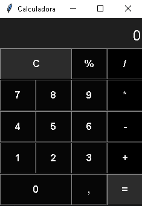

# Calculadora

## Descrição

 Calculadora feita em Python usando Tkinter. Faz cálculos matemáticos.

## Como Usar

### Instalando
Clone este repositorio:

```git clone https://github.com/NicholasDRR/Calculadora.git```

Entre no repositorio:
```cd Calculadora```

Instalar Requisitos:
```pip install -r REQUIREMENTS.txt```

## Abrindo

Abrir o Cmd ou PowerShell na pasta e rodar o comando: ```python main.py```

## Task-List


- [X] Criar janela
- [X] Dividir frames (visor e botões)
- [X] Personalizar botões
- [X] Personalizar visor
- [X] Adicionar funcionalidade aos botões
- [X] Criar função mostrar()
- [X] Criar função calcular()
- [X] Criar função limpatela()
- [X] Corrigir bugs e exceções


Extras:

- [ ] Função para apagar último dígito
- [ ] Pensar em uma forma mais segura referente a falhas de segurança
 

## Imagem


